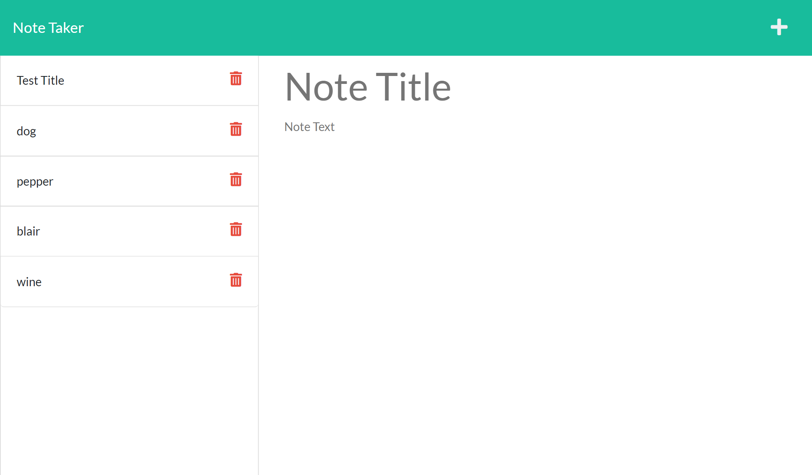

# Note Taker App

## Description
My motivation in creating this Note Taker App is to expand my knowledge with using Express and connecting front end and back end code.
I built this project to help organize notes.
This will make it easy to see what is on your to do list and delete as completed.
I learned how to use Express and Heroku to help further my coding abilities.

*Link to deployed app: https://note-taker-blair.herokuapp.com/notes

## Credits

created by Blair Seivers :)
